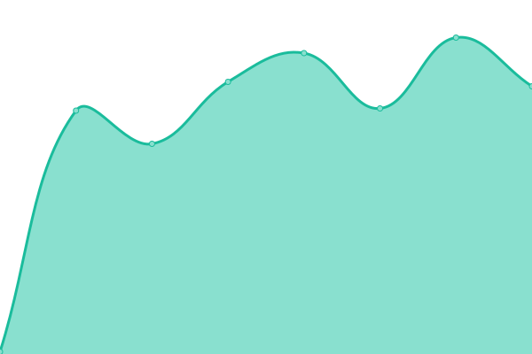

# [📈 Live Status](https://status.qss.azuma-health.tech): <!--live status--> **🟩 All systems operational**

This repository contains the open-source uptime monitor and status page for [azuma-healthtech-public](https://status.qss.azuma-health.tech), powered by [Upptime](https://github.com/upptime/upptime).

With [Upptime](https://upptime.js.org), you can get your own unlimited and free uptime monitor and status page, powered entirely by a GitHub repository. We use [Issues](https://github.com/azuma-healthtech-public/uptime-qss/issues) as incident reports, [Actions](https://github.com/azuma-healthtech-public/uptime-qss/actions) as uptime monitors, and [Pages](https://status.qss.azuma-health.tech) for the status page.

<!--start: status pages-->
<!-- This summary is generated by Upptime (https://github.com/upptime/upptime) -->
<!-- Do not edit this manually, your changes will be overwritten -->
<!-- prettier-ignore -->
| URL | Status | History | Response Time | Uptime |
| --- | ------ | ------- | ------------- | ------ |
|  [azuma: API](https://qss.azuma-health.tech/health/doa-gateway) | 🟩 Up | [azuma-api.yml](https://github.com/azuma-healthtech-public/uptime-qss/commits/HEAD/history/azuma-api.yml) | 

 8258ms
     
 | 

<a href="https://status.qss.azuma-health.tech/history/azuma-api">100.00%</a>
    

|  [azuma: Zero Trust Gateway](https://qss.azuma-health.tech/health/gateway) | 🟩 Up | [azuma-zero-trust-gateway.yml](https://github.com/azuma-healthtech-public/uptime-qss/commits/HEAD/history/azuma-zero-trust-gateway.yml) | 

 125ms
     
 | 

<a href="https://status.qss.azuma-health.tech/history/azuma-zero-trust-gateway">100.00%</a>
    

|  [azuma mimoto: Authorization Service](https://qss.azuma-health.tech/health/mimoto-auth) | 🟩 Up | [azuma-mimoto-authorization-service.yml](https://github.com/azuma-healthtech-public/uptime-qss/commits/HEAD/history/azuma-mimoto-authorization-service.yml) | 

 13011ms
     
 | 

<a href="https://status.qss.azuma-health.tech/history/azuma-mimoto-authorization-service">100.00%</a>
    

|  [azuma doa: Identity Service](https://qss.azuma-health.tech/health/doa-idp) | 🟩 Up | [azuma-doa-identity-service.yml](https://github.com/azuma-healthtech-public/uptime-qss/commits/HEAD/history/azuma-doa-identity-service.yml) | 

 12490ms
     
 | 

<a href="https://status.qss.azuma-health.tech/history/azuma-doa-identity-service">100.00%</a>
    

|  [azuma doa: OAuth 2.0 and OpenID Connect Provider](https://qss.azuma-health.tech/health/doa-oidc) | 🟩 Up | [azuma-doa-o-auth-2-0-and-open-id-connect-provider.yml](https://github.com/azuma-healthtech-public/uptime-qss/commits/HEAD/history/azuma-doa-o-auth-2-0-and-open-id-connect-provider.yml) | 

 8674ms
     
 | 

<a href="https://status.qss.azuma-health.tech/history/azuma-doa-o-auth-2-0-and-open-id-connect-provider">100.00%</a>
    

|  [azuma doa: Tenant & Organization Service](https://qss.azuma-health.tech/health/doa-organization) | 🟩 Up | [azuma-doa-tenant-and-organization-service.yml](https://github.com/azuma-healthtech-public/uptime-qss/commits/HEAD/history/azuma-doa-tenant-and-organization-service.yml) | 

 126ms
     
 | 

<a href="https://status.qss.azuma-health.tech/history/azuma-doa-tenant-and-organization-service">100.00%</a>
    

|  [azuma doa: Administration Service](https://qss.azuma-health.tech/health/doa-admin) | 🟩 Up | [azuma-doa-administration-service.yml](https://github.com/azuma-healthtech-public/uptime-qss/commits/HEAD/history/azuma-doa-administration-service.yml) | 

 11496ms
     
 | 

<a href="https://status.qss.azuma-health.tech/history/azuma-doa-administration-service">100.00%</a>
    

|  [azuma doa: Mailing Service](https://qss.azuma-health.tech/health/doa-mailing) | 🟩 Up | [azuma-doa-mailing-service.yml](https://github.com/azuma-healthtech-public/uptime-qss/commits/HEAD/history/azuma-doa-mailing-service.yml) | 

 9356ms
     
 | 

<a href="https://status.qss.azuma-health.tech/history/azuma-doa-mailing-service">100.00%</a>
    

<!--end: status pages-->

[**Visit our status website →**](https://status.qss.azuma-health.tech)

## 📄 License

- Powered by: [Upptime](https://github.com/upptime/upptime)
- Code: [MIT](./LICENSE) © [azuma-healthtech-public](https://status.qss.azuma-health.tech)
- Data in the `./history` directory: [Open Database License](https://opendatacommons.org/licenses/odbl/1-0/)
